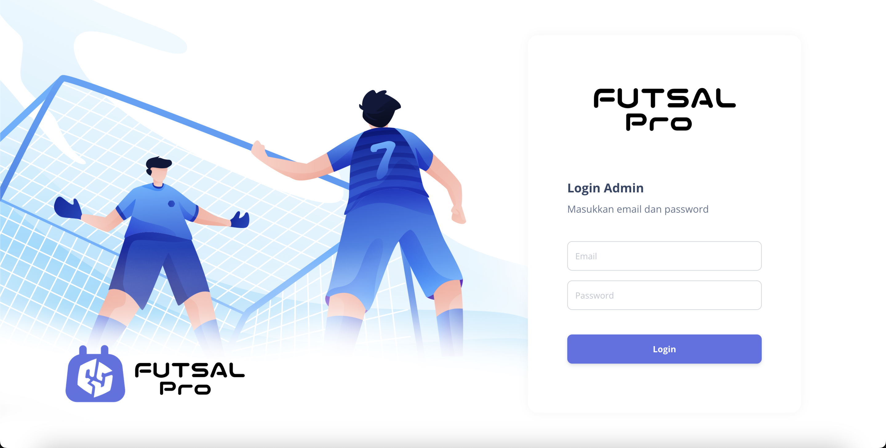
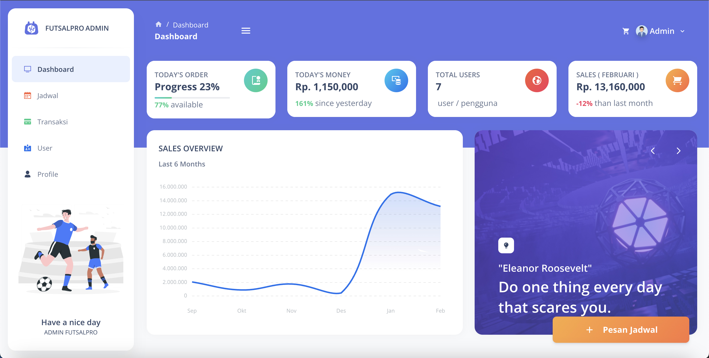
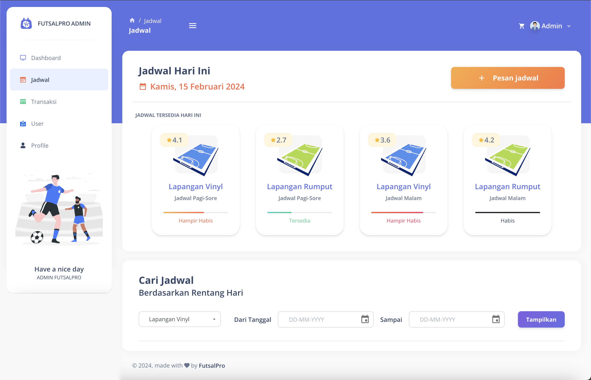
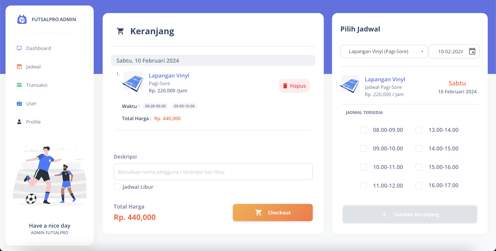
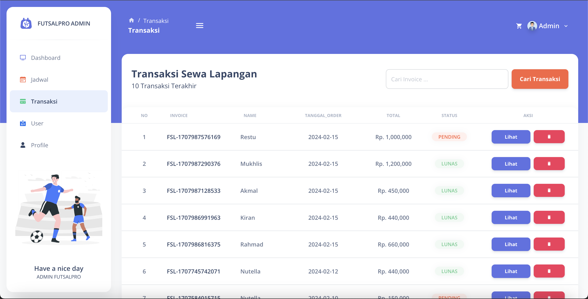
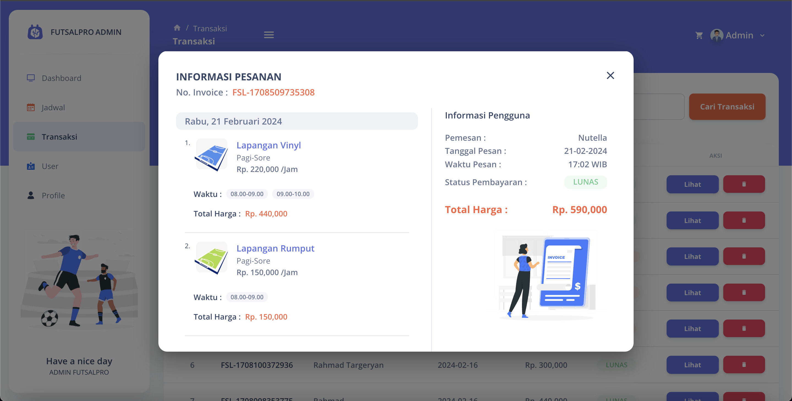
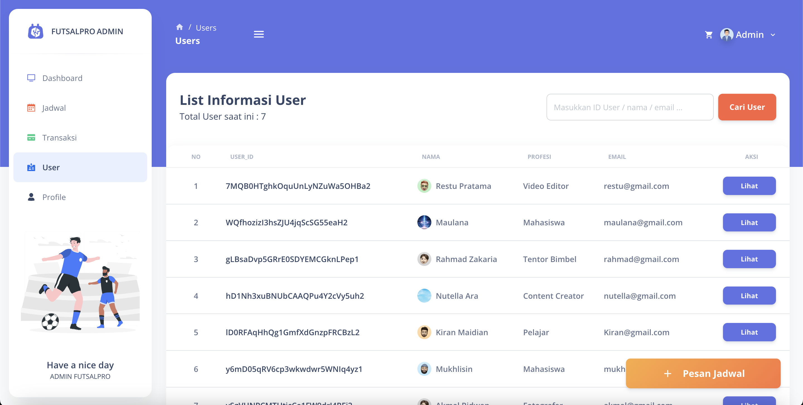
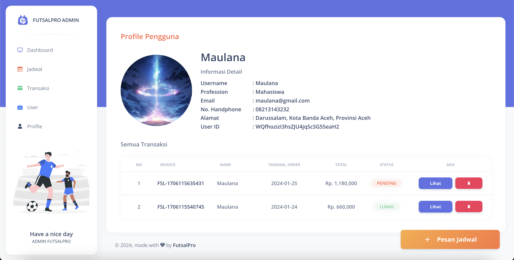

# FUTSALPRO - ADMIN

Library : ReactJs Library,
Database : Firebase,
State Management : Redux,

1. npm install
2. config .env
3. npm run start

Preview

LOGIN

DASHBOARD

SCHEDULE

CHECKOUT

TRANSACTION

DETAIL TRANSACTION

USER

INFORMATION USER

[FUTSALPRO-ADMIN] : https://futsallpro.netlify.app/
